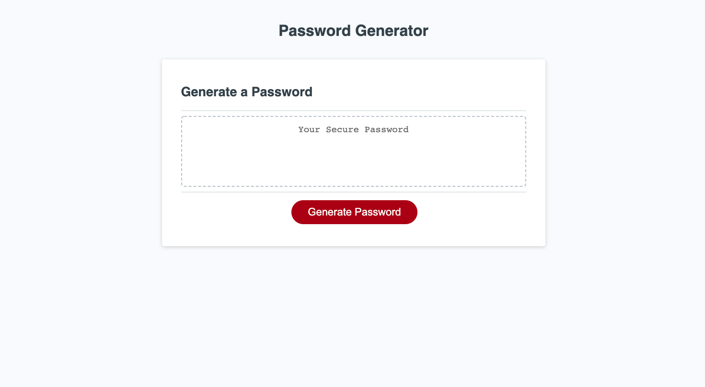

# JavaScript-PasswordGen

Password Generator Homework

This repository lets user select what type of password they would like.

1. Allows user to generate a password.
2. Prompts user to select how many characters they want to be in their password.
3. Prompts user to decide if they want lower case letters, upper case letters, numbers and/or special characters.
4. Once all prompts have been answered, site will generate randomized password for user.

Below, find attached links to Github repository and deployed finished project.

[Live link to site](https://kylejames20.github.io/JavaScript-PasswordGen/)

[Direct link to Github repository](https://github.com/kylejames20/JavaScript-PasswordGen)